# From Treatment to Prevention — Machine learning applied to the elderly population and to patients affected by stroke.

## Section 1 - Introduction

Frailty poses a significant challenge for aging populations, as growing elderly care needs strain healthcare systems. In response, this study introduces a machine‑learning framework for classifying and predicting frailty, using publicly available EU datasets and comparing its performance with recent work from North America and Asia. We focus on three main objectives: (1) classifying frailty among older adults, (2) detecting frailty in post‑stroke patients, and (3) forecasting health improvements.

For the first objective, we merge physical measurements with socio‑clinical variables; for the second, we derive four gait metrics from wearable inertial sensors. We then assess several classifiers, emphasizing models that clinicians can interpret, and employ PCA to illustrate how well the groups separate. Our results highlight that feature importance varies by country, underscoring the need to account for cultural and demographic differences in model development.

Despite challenges such as imbalanced classes and scarce longitudinal follow‑up, our framework shows robust generalizability and interpretability. It surpasses current methods in elderly frailty classification and nearly matches leading stroke‑related approaches. By combining sensor‑based metrics with socio‑clinical data, the framework equips clinicians with a practical tool for frailty evaluation. Finally, we emphasize the necessity of interoperable health systems and call for closer collaboration between healthcare professionals and machine‑learning experts to shift from reactive treatment toward proactive frailty prevention across diverse populations.

DOI Research paper
-----------------
http://dx.doi.org/10.13140/RG.2.2.26133.23529

Keywords: 
-----------------
Elderly care; healthcare sustainability; stroke rehabilitation; frailty classification; demographic variability; FFP; FAC; health improvement prediction;  interoperability; gait analysis; AI; Machine Learning; feature engineering; SHAP; Principal Component Analysis;  SMOTE; class imbalance; Random Forest.


Short description
-----------------
This repository implements a machine‑learning framework for frailty classification and health‑improvement prediction in elderly and post‑stroke populations. The project combines socio‑clinical variables and sensor‑derived gait features, uses PCA and SHAP for interpretability, and evaluates classifiers with SMOTE tuning (Random Forest, Gradient Boosting, Logistic Regression, etc.).

Core objectives
---------------
- Classify frailty in elderly populations using socio‑clinical data and derived features.
- Detect frailty in post‑stroke patients using wearable inertial sensor gait features.
- Predict short‑term health improvement and identify clinically meaningful features.

Repository contents
-------------------
- prediction.ipynb — main analysis notebook (feature extraction, PCA, feature selection, model training, evaluation, plots).
- master_windows_with_labels.csv — aggregated windowed feature outputs (cached intermediate).
- images/ — figures used in the thesis and notebooks (e.g. images/pca_variance.png).

Quick start
-----------
1. Open the main analysis notebook:
   - Open c:\Users\admin\Documents\frailty\prediction.ipynb in Jupyter Lab or VS Code Jupyter.
2. Install dependencies:
```sh
pip install -r requirements.txt   # or use environment.yml
jupyter lab
```
3. Run the analysis:
   - For a full end‑to‑end run, execute the notebook top‑to‑bottom. Heavy steps (raw sensor windowing / feature extraction) are time‑consuming; use cached intermediate files when available:
     - master_windows_with_labels.csv contains precomputed window features and labels used by downstream steps.
     - If you need to re‑compute windows, run the feature extraction cells (labeled "windowing" / "derive features") and allow enough time or run them on a machine with adequate CPU.
   - Reproducible flow:
     1. Prepare raw datasets under the dataset folders (see notebook comments).
     2. Run preprocessing and windowing (or load master_windows_with_labels.csv).
     3. Run PCA, feature selection, and model training cells.

Notes on datasets & reproducibility
----------------------------------
- Some analysis depends on external open datasets referenced in the thesis; obtain them and place under the dataset* folders as documented in the notebook.
- Results depend on random seeds, train/test splits, and SMOTE settings — seeds are set in the notebooks for reproducibility where applicable.
- Be mindful of data licenses for any public datasets before redistribution.

Figures & images
----------------
All thesis figures referenced by the notebooks and README are in the images/ folder. Examples:
- images/pca_variance.png — PCA explained variance plot used in the thesis.
- Other plots (feature importance, SHAP summaries, PCA visualizations) are saved alongside notebooks; open prediction.ipynb to regenerate.

How to cite
-----------
Please mention this GitHub Repo and the DOI of the Research paper: 
http://dx.doi.org/10.13140/RG.2.2.26133.23529


License & data
--------------
- Code in this repository: check LICENSE (or add one) before reuse.
- Data files may include derived outputs from open datasets. Verify and comply with original dataset licenses prior to sharing.

Contributing & issues
---------------------
- Issues and pull requests are welcome. When reporting problems, reference the notebook file and the specific cell(s) causing the issue.
- For large compute or dataset questions, include system specs and whether you used cached intermediate files (e.g., master_windows_with_labels.csv).

Contact
-------
Please send me a direct message on GitHub.
For repository issues, open a GitHub issue and include notebook name and cell index.

## 2 Related works

This section summarizes key literature on machine‑learning applications for frailty, gait monitoring and stroke rehabilitation. It highlights target definitions (FFP, FI), common data sources (EHRs, questionnaires, wearable IMUs), typical features and modelling choices, and the need for interpretability and interoperability.

Highlights
- Frailty definitions
  - Fried Frailty Phenotype (FFP): 5 criteria → robust / pre‑frail / frail (weight loss, exhaustion, low activity, slow gait, weakness).
  - Frailty Index (FI): deficit accumulation ratio (0–1).
- Data & sensors
  - EHR / questionnaire data (UK, Canada, China studies).
  - Wearable IMUs (wrist/ankle/foot/trunk) for free‑living gait/activity monitoring.
- Common ML methods
  - Tree ensembles (Random Forest, Gradient Boosting / XGBoost), SVM, logistic regression, kNN, MLP.
  - SMOTE used widely to address class imbalance.
  - SHAP / feature‑ranking for explainability is recommended but still underused.
- Practical notes
  - Interpretability is crucial for clinical adoption; many high‑performing models lack transparent explanations.
  - Longitudinal and multi‑device data improve detection/prediction but require careful preprocessing and interoperability.

Selected regional studies (brief)
### European Union
  - Abbas et al. (2021, 2022): objective measurements + self‑reports; wearable longitudinal monitoring; derived gait features (intensity, dynamism, cadence, pattern). See: "Identifying Physical Worsening in Elderly Using Objective and Self‑Reported Measures" (ICABME 2021) — https://ieeexplore.ieee.org/document/9604819 and "Acceleration‑based gait analysis for frailty assessment in older adults" (Pattern Recognition Letters, 2022) — https://www.sciencedirect.com/science/article/abs/pii/S0167865522002197. Combined measured + self‑reported features improve reliability.
  - Bochniewicz et al.: wrist IMU + Random Forest to classify functional vs non‑functional arm use. See "Measuring Functional Arm Movement after Stroke Using a Single Wrist‑Worn Sensor and Machine Learning" (2017) — https://pubmed.ncbi.nlm.nih.gov/28781056/
  - Zhou et al.: foot IMU trajectories and spatio‑temporal gait metrics for stroke rehab monitoring (visualization + improvement detection). Dataset / paper: Zenodo dataset (2024) — https://zenodo.org/records/10534055 (DOI:10.5281/zenodo.10534055) and conference paper — https://pubmed.ncbi.nlm.nih.gov/40039788/.

### United Kingdom
  - Leghissa et al.: large longitudinal study using derived FFP from survey data; logistic regression and MultiSURF feature selection; emphasis on long‑term prediction and feature derivation from questionnaires. See: "FRELSA: A dataset for frailty in elderly people..." — https://www.sciencedirect.com/science/article/pii/S1386505624002661

### North America
  - Aponte et al.: primary care EMR data (CPCSSN) with structured features; boosting models performed best; used SMOTE and emphasized physician‑assigned labels variability. See: "Machine learning for identification of frailty in Canadian primary care practices" — https://ijpds.org/article/view/1650
  - Thapa et al.: fall risk prediction using vitals + EHR; XGBoost best and SHAP used for explainability (medications, comorbidities top predictors). See: "Predicting Falls in Long-term Care Facilities: Machine Learning Study" (JMIR Aging, 2022) — https://aging.jmir.org/2022/2/e35373
  - Chen / Lucas et al.: IMU‑based monitoring in stroke patients (XGBoost / decision tree / RF; accuracy often 70–90% depending on task and features). See: Chen (IJERPH pilot) — https://pubmed.ncbi.nlm.nih.gov/33572116/ and Lucas et al. (IEEE JTEHM) — https://doi.org/10.1109/JTEHM.2019.2897306

### Asia
  - Wu et al. (China): CLHLS‑HF cohort, Frailty Index trajectories and group‑based trajectory modelling; Random Forest + SHAP for explainability; social, ADL and chronic disease variables important. See: Wu et al. (BMC Geriatrics, 2022) — https://doi.org/10.1186/s12877-022-03576-5
  - Hong Kong studies (Yu et al., Wang et al.): integrated telehealth + wearable monitoring with decision trees and small neural nets; combining station vitals and continuous wearable data improved anomaly detection. See: Yu et al. (IEEE Access, 2018) — https://ieeexplore.ieee.org/document/8389199 and Wang et al. (JMIR, 2020) — https://www.jmir.org/2020/9/e19223/
  - Korea (Kim / Lee / Park): video/vision and IMU approaches to classify FAC and gait severity in stroke patients using deep or classical ML (accuracy ≈ 80–90%). See: Kim et al. (Topics in Stroke Rehabilitation, 2024) — https://pubmed.ncbi.nlm.nih.gov/38841903/ ; Lee et al. (Journal of Personalized Medicine, 2021) — https://www.mdpi.com/2075-4426/11/11/1080 ; Park et al. (JMIR preprint) — https://pmc.ncbi.nlm.nih.gov/articles/PMC7527905/

### Further reading 
- Leghissa et al. (FRELSA), Morley et al., Fried et al., Rockwood & Mitnitski — for definitions and frailty indices. See: Leghissa (FRELSA) — https://www.sciencedirect.com/science/article/pii/S1386505624002661 ; Morley — https://pubmed.ncbi.nlm.nih.gov/23764209/ ; Fried (FFP) — https://doi.org/10.1093/gerona/56.3.M146 ; Rockwood & Mitnitski — https://www.researchgate.net/publication/6204727_Frailty_in_Relation_to_the_Accumulation_of_Deficits
- Abbas et al., Bochniewicz et al., Zhou et al. — EU sensor and longitudinal works. See: Abbas (ICABME 2021) — https://ieeexplore.ieee.org/document/9604819 and Abbas (2022 PRL) — https://www.sciencedirect.com/science/article/abs/pii/S0167865522002197 ; Bochniewicz et al. — https://pubmed.ncbi.nlm.nih.gov/28781056/ ; Zhou et al. (stroke IMU dataset) — https://doi.org/10.5281/zenodo.10534055
- Aponte et al., Thapa et al., Chen et al., Lucas et al. — North American sensor/EHR studies. See: Aponte et al. — https://ijpds.org/article/view/1650 ; Thapa et al. (JMIR Aging) — https://aging.jmir.org/2022/2/e35373 ; Chen et al. (IJERPH) — https://pubmed.ncbi.nlm.nih.gov/33572116/ ; Lucas et al. (IEEE JTEHM) — https://doi.org/10.1109/JTEHM.2019.2897306
- Wu et al., Yu et al., Kim/Lee/Park — Asia region studies (China, Hong Kong, Korea). See: Wu et al. (BMC Geriatrics) — https://doi.org/10.1186/s12877-022-03576-5 ; Yu et al. (IEEE Access) — https://ieeexplore.ieee.org/document/8389199 ; Lee et al. (JPM 2021) — https://www.mdpi.com/2075-4426/11/11/1080 ; Kim et al. (Topics in Stroke Rehabilitation, 2024) — https://pubmed.ncbi.nlm.nih.gov/38841903/ ; Park et al. (JMIR preprint) — https://pmc.ncbi.nlm.nih.gov/articles/PMC7527905/


## 3 Research Method

Summary
- The project uses supervised ML to study frailty as a classification task (FFP) and as a proxy regression/classification task via Functional Ambulation Category (FAC).  
- Two complementary EU datasets are used: a cross‑sectional, socio‑clinical dataset and a longitudinal IMU dataset (Zhou et al.) for stroke rehabilitation.  
- Pipeline stages: data ingestion → windowing → feature engineering (F1–F4, AR features optional) → stats & ranking → PCA → SMOTE (embedded, tuned) → randomized hyperparameter search → evaluation and interpretability (SHAP + tree importances).

### 3.1 Overview of targets and data selection
- Primary classification target: Fried Frailty Phenotype (FFP) where available; for the stroke dataset FAC is used and mapped to FFP (Table 7).  
- Included datasets: EU Open Research Repository sensor datasets and the stroke cohort from Zhou et al. (Charité, Germany). UK/China datasets were considered but excluded where self-reports or access limitations could bias model training.

#### Collection methods: 

  <div style="display:flex;gap:12px;align-items:flex-start;">
    <a href="images/fig2_wrist_IMU.png">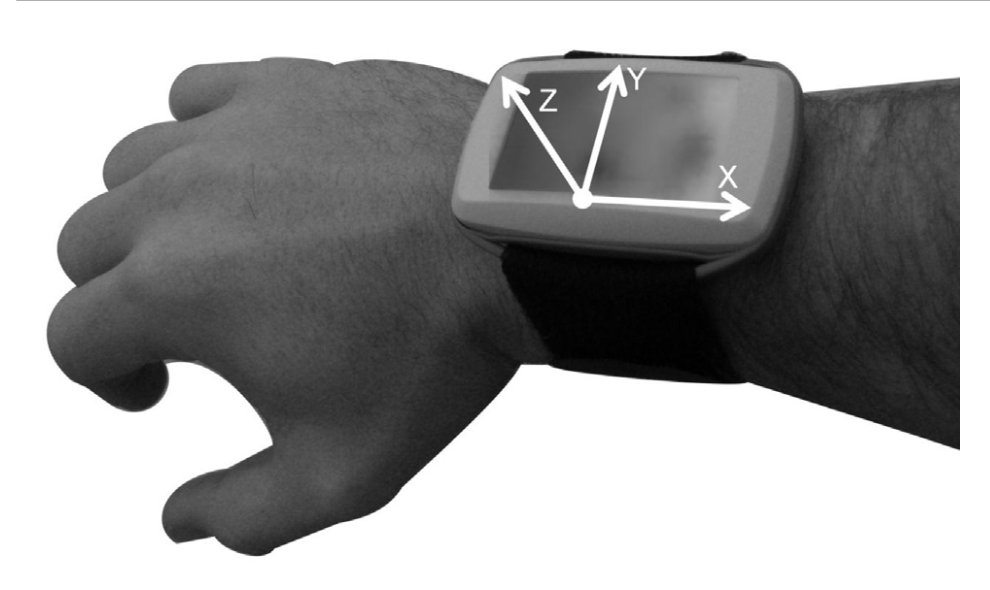</a>
    <a href="images/fig1_limbs_IMU.png">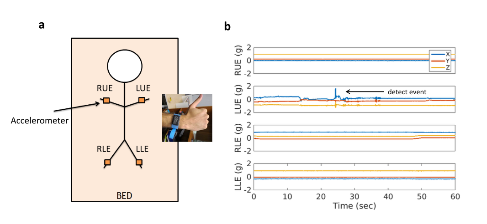</a>
    <a href="images/fig3_foot_IMU.png">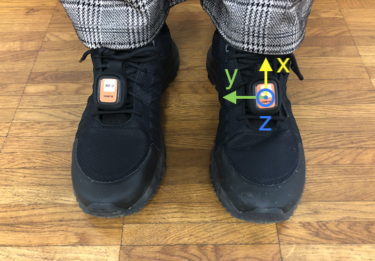</a>
  </div>

### 3.2 Stroke sub-study (research question 2)
- Goal: (i) classify mobility (FAC / derived FFP) from IMU windows, (ii) predict short-term improvement between two visits.  
- Raw IMU sampling: 120 Hz, five sensor placements per subject (LF, RF, LW, RW, SA). Windows: non-overlapping 6 s (720 samples). Final stroke window set: 3,248 windows after cleaning.

### 3.3 Data reduction & missing data
- Non-overlapping 6 s windows (discard incomplete trailing samples).  
- Missing wrist data for subject imu0011 (visit1) is documented and excluded for those placements; no imputation performed due to low N.

### 3.4 Feature engineering (per 6 s window)
- Core signal-based gait features (per sensor placement):  
  - F1 — Intensity: trimmed (25%) range of acceleration magnitude (||a||, in g).  
  - F2 — Cadence: detected peaks per window → steps/sec.  
  - F3 — Periodicity: normalized autocorrelation entropy (Wiener–Khinchin → entropy of lag histogram).  
  - F4 — Dynamism: ratio of large inter-sample |Δa| jumps (threshold = 75th percentile).  
- Optional: AR‑based features (F5/F6) computed from vertical axis and used/neutralized when appropriate.  
- Features are pooled per placement or aggregated by placement‑group (LowerLimbs, UpperLimbs, Trunk) for analysis.

<div style="display:flex;flex-wrap:wrap;gap:12px;">
  <div style="flex:1 1 48%;text-align:center;">
    <a href="images/acceleration_magnitude.png">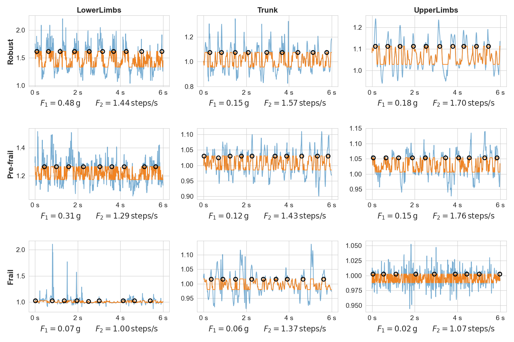</a>
    <div>Acceleration magnitude</div>
  </div>
  <div style="flex:1 1 48%;text-align:center;">
    <a href="images/F1.png">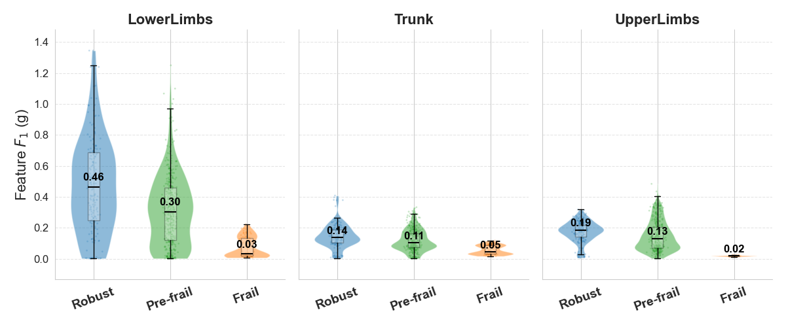</a>
    <div>F1 violin plot</div>
  </div>

  <div style="flex:1 1 48%;text-align:center;">
    <a href="images/autocorr_single.png">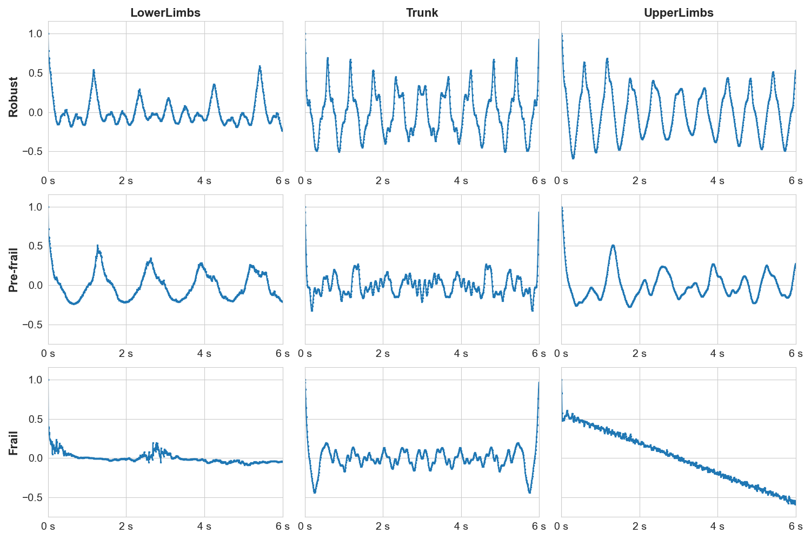</a>
    <div>Autocorrelation</div>
  </div>
  <div style="flex:1 1 48%;text-align:center;">
    <a href="images/F2.png">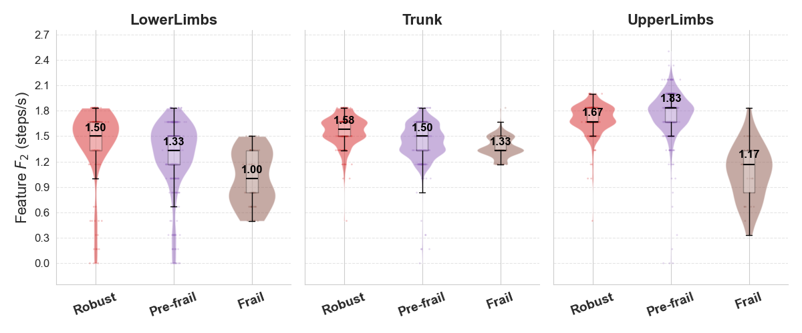</a>
    <div>F2 violin plot</div>
  </div>

  <div style="flex:1 1 48%;text-align:center;">
    <a href="images/F3.png">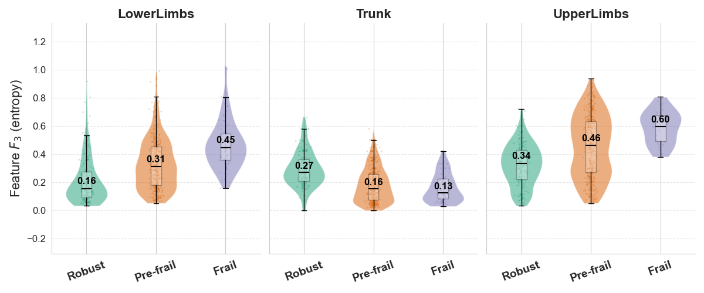</a>
    <div>F3 violin plot</div>
  </div>
  <div style="flex:1 1 48%;text-align:center;">
    <a href="images/F4.png">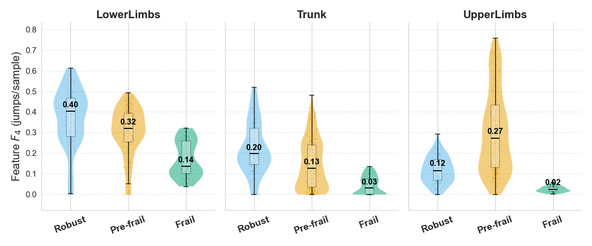</a>
    <div>F4 violin plot</div>
  </div>
</div>

### 3.5 Statistical testing & feature ranking
- Non‑parametric tests: Mann–Whitney U (pairwise) and Kruskal–Wallis across Robust / Pre‑frail / Frail.  
- ReliefF (k=5) for feature ranking; F4 and F1 rank highest in this study (consistent with baseline trends).


### 3.6 Dimensionality reduction (PCA)
- PCA on selected features (F1–F4) per region for visualization and centroid analysis. The first 3 PCs retain most variance (> ~95% for aggregated features) and are interpreted as: PC1 (vigor), PC2 (stability), PC3 (rhythm).

- 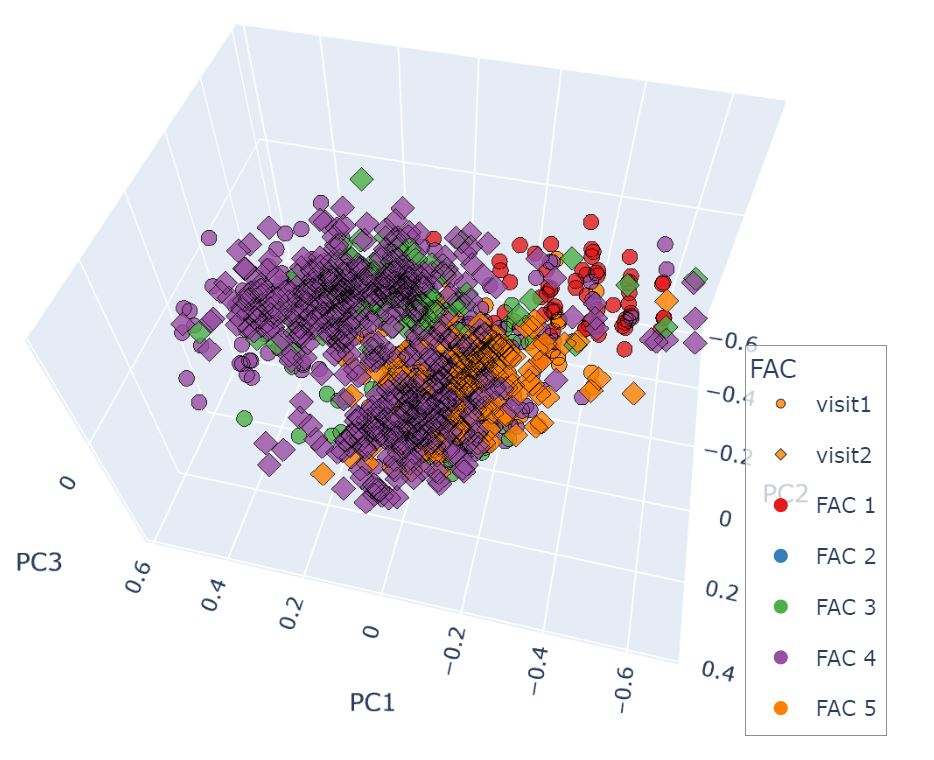 - PCA upper limbs
- 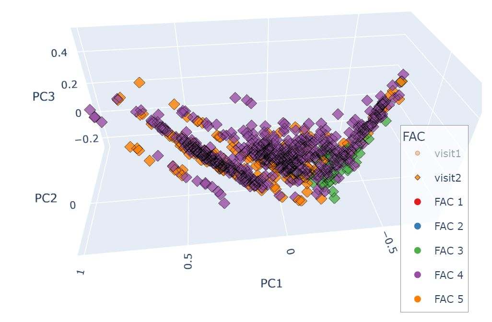 - PCA lower limbs
- 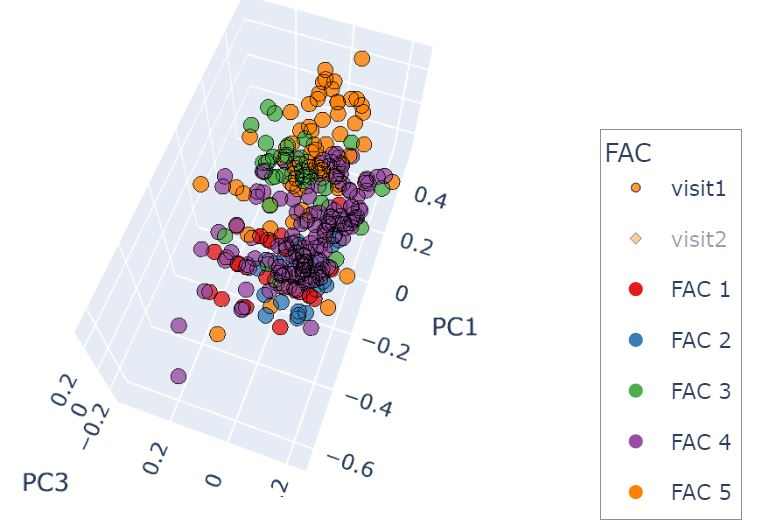 - PCA trunk
- 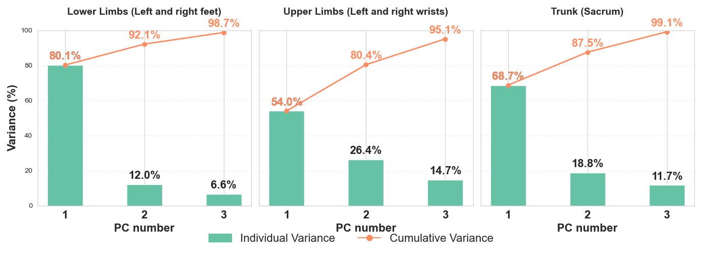 — PCA variance figure (already present)

### 3.7 Class imbalance handling
- SMOTE is embedded in the pipeline and treated as hyperparameters (sampling_strategy ∈ {'auto','not majority'}, k_neighbors ∈ {3,5,7}).  
- SMOTE is applied only on training folds inside cross‑validation to avoid leakage; sampling settings are optimized together with classifier hyperparameters.

- 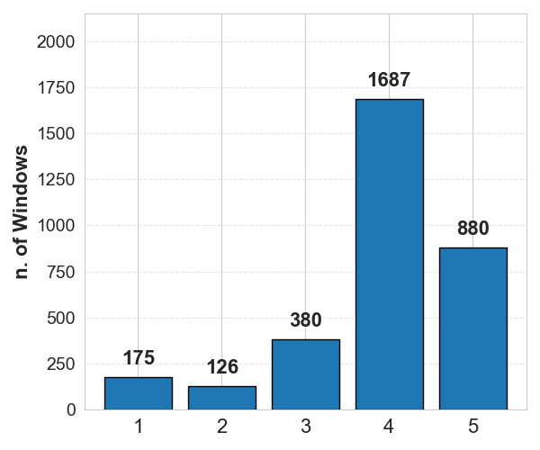 - FAC class distribution
- 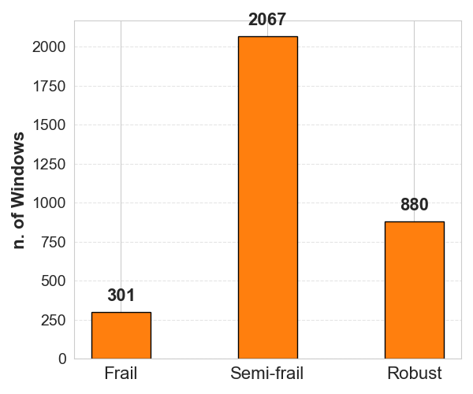 - FFP class distribution


### 3.8 Model selection & optimization
- Classifiers: Decision Tree, Random Forest, Gradient Boosting, Logistic Regression (elasticnet), SVM (RBF), MLP.  
- Hyperparameter tuning: RandomizedSearchCV with StratifiedKFold (5 folds), scoring = f1_macro. SMOTE parameters included in the search space. Train/test split = 80:20. Example best params are summarized in Table 14 (see thesis/notebook).

### 3.9 Predicting improvement (aggregation)
- Window-level FAC predictions → per patient & placement medians for visit1 and visit2.  
- Improvement flag = 1 if median_pred_visit2 − median_pred_visit1 > 0 (Eq. 9). Same rule applied to true FAC medians to obtain ground truth. Performance reported at patient and patient×placement granularity.

## 3.10 Interpretability
- Two complementary explainability methods:
  - Tree-based feature importances (RF / GB): fast, global view of feature contribution.  
  - SHAP: global and per-sample explanations for FAC and FFP derived predictions (beeswarm, force plots, class‑specific summary). Both are provided in notebooks and figures.

## 3.11 Reproducibility notes
- Random states are set where applicable; SMOTE and randomized search variability remains — seeds stored in notebooks.  
- Full end‑to‑end runs require raw datasets placed under dataset* folders; heavy steps (windowing, AR fitting, randomized searches) can be time‑consuming — cached CSVs such as master_windows_with_labels.csv are provided to speed reproductions.

## 4 Experimental results

This section reports key outcomes for the stroke sub‑study (Research Question 2), model interpretability (RQ3) and cross‑framework comparisons (RQ4). Full numeric tables and plots are available in the notebook; representative figures are stored in the images/ folder and referenced below.

### 4.2 Research question 2 — Frailty classification & prediction of health improvement (stroke)

#### 4.2.1 First sub‑problem — FAC (mobility) classification  
- Six tuned classifiers were evaluated on the multi‑class FAC task (FAC 1–5). Results are reported as macro‑averaged metrics to mitigate class imbalance effects. Random Forest achieved the best window‑level F1 (0.636) and ROC–AUC (0.901). Gradient Boosting and the MLP follow closely (F1 ≈ 0.60–0.62). Logistic Regression scored lowest (F1 ≈ 0.40).  
- Collapsing FAC into FFP (FFP: Robust / Semi‑frail / Frail) increases apparent accuracy; RF remains best (FFP F1 ≈ 0.696).  
- ROC curves for FAC (multi‑class macro average) are saved in images/ROC_FAC.png; ROC curves after FFP mapping are in images/ROC_FFP.png. Confusion matrices are available in images/FFP_confusion_matrix.png and images/FFP_confusion_matrix_pct.png — they show most errors occur between adjacent classes (e.g., frail ↔ semi‑frail).  
- Key takeaways: high ROC–AUC does not alone ensure clinically useful detection of minority frail cases; sensitivity, precision and specificity must be considered alongside F1.

Figures / images:
- 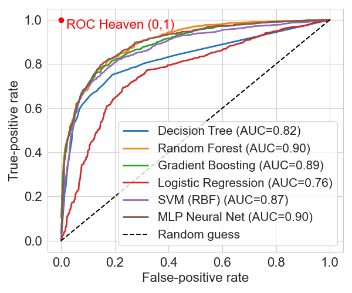 - ROC (FAC multi‑class, macro average).
-  - ROC (FFP after FAC→FFP mapping).
- 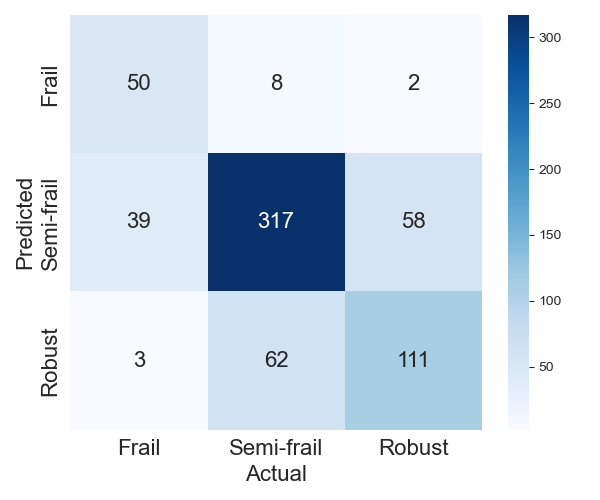 - FFP confusion matrix (counts).
- 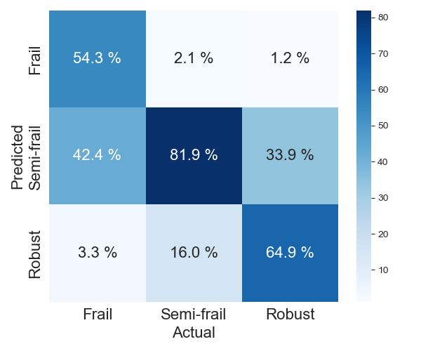 - FFP confusion matrix (percent).
- 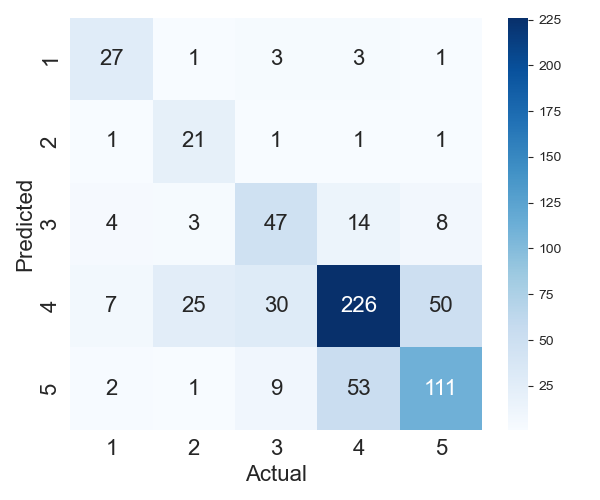 - FAC confusion matrix (counts).
- 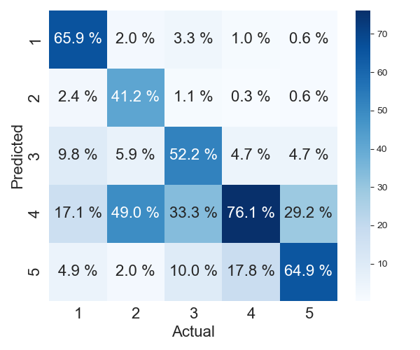 - FAC confusion matrix (percent).

#### 4.2.2 Second sub‑problem — Predicting health improvement between visits  
- Patient‑level improvement: Random Forest predicted patient‑level improvement perfectly on the held‑out test set (10/10 correct in this cohort). Table summary: RF Patient‑level F1 = 1.00 (see notebook). Radar plots compare predicted vs true medians per placement and visit: images/radar_Gradient_Boosting.png and images/radar_Random_Forest.png (saved as radar_{model}.png by the notebook).  
- Patient×Placement level: performance degrades when evaluating each patient×sensor placement (n ≈ 47 placements). Gradient Boosting achieved higher placement‑level accuracy (≈ 0.87) vs RF (≈ 0.81). Confusion matrices for improvement prediction (RF) are saved under images/{model}_imp_confusion_* (e.g., images/Random_Forest_imp_confusion_counts.png).  
- Figures / images:
  - 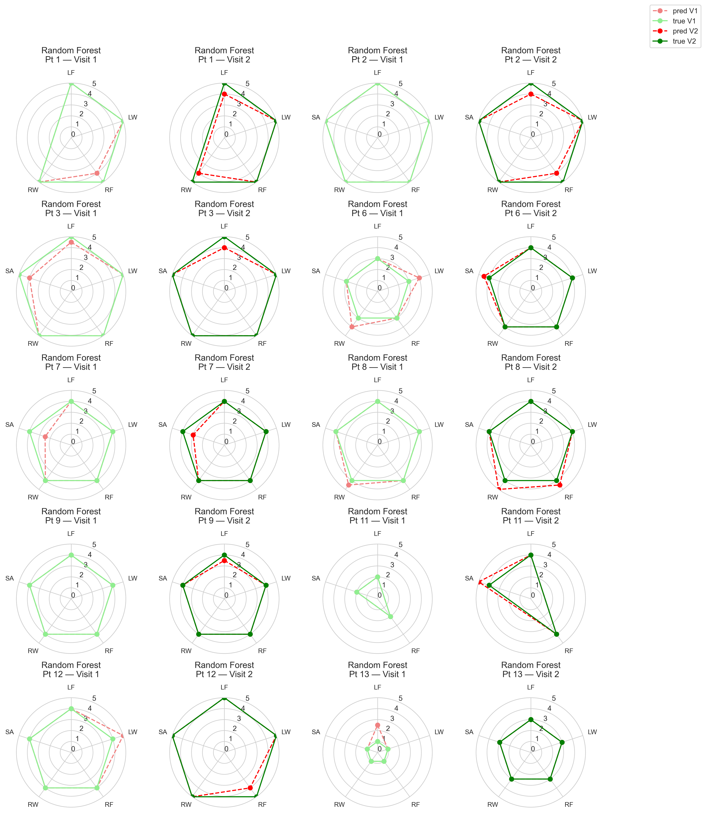 - radar plots (Random Forest predictions vs true).

#### 4.2.3 Notes on clinical trade‑offs and SMOTE  
- The pipeline uses adaptive SMOTE inside CV and optimizes its parameters with each classifier; this improves recall for minority frail classes but can increase synthetic‑sample overlap near boundaries and reduce specificity. Classifier thresholds can be tuned for application‑specific trade‑offs (screening vs triage vs trial recruitment).  
- images/balanceSMOTE.png visualizes class balance across studies and the dataset used here.

### 4.3 Research question 3 — Interpretability

#### 4.3.2 Interpretability for the stroke (FAC) task (RQ2)  
- Random Forest impurity reduction and SHAP agree that biomechanical predictors F1 (intensity) and F4 (dynamism) are the dominant cues (combined ~70%+ of impurity reduction). F3 (periodicity) and F2 (cadence) provide secondary information. ReliefF ranking also supports F4 and F1 as top features (see Table 12 and Table 22).  
- SHAP per‑class plots (FAC 1…5) show how feature values push probabilities toward or away from each FAC class; these are rendered and saved by the notebook (images/summary_beeswarm_*.png and images/force_*.png).

- 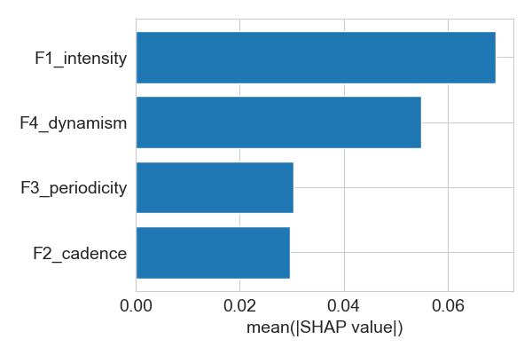,   
- 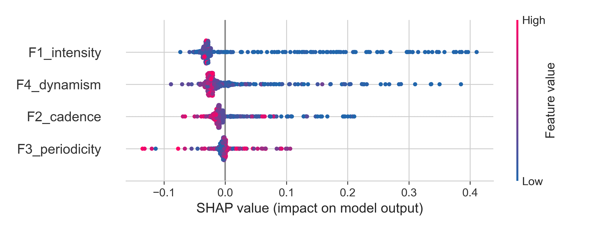 — SHAP FAC 1
- 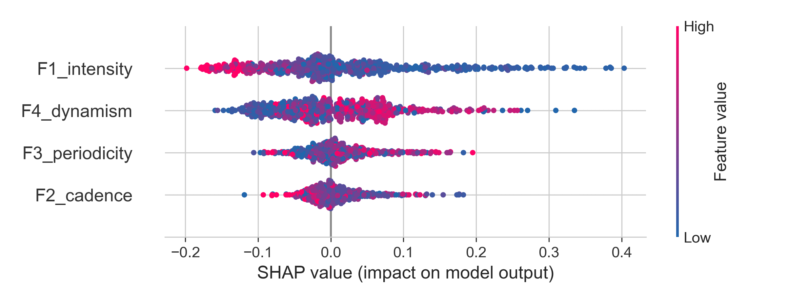 — SHAP FAC 3
- 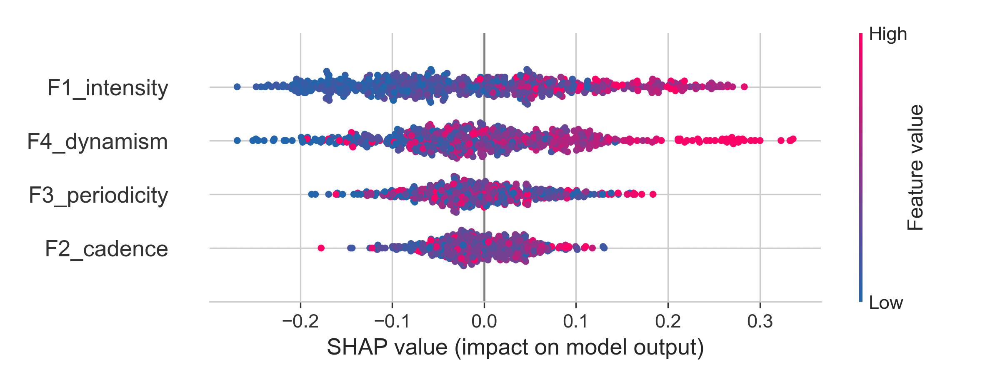 — SHAP FAC 4

### 4.4 Research question 4 — Frameworks comparison

- The README includes comparative tables (see thesis and notebook). Summary conclusions:
  - For frailty classification in general elderly cohorts, models that combine measured physical features with socio‑clinical variables (balanced datasets) achieve the highest accuracy / F1.
  - For stroke cohorts with constrained sample sizes and class imbalance, gait‑only feature sets (F1–F4) deliver clinically meaningful signals but underperform richer feature sets trained on balanced cohorts.
  - Our RF + adaptive‑SMOTE pipeline achieves competitive results on the stroke FAC task (RF window‑level ROC–AUC ≈ 0.90, FFP F1 ≈ 0.70) and excellent patient‑level improvement prediction in this small cohort.

Comparison / figures:
- 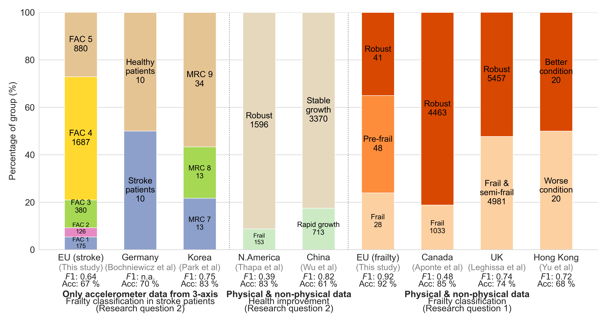 - class balance & study comparison
- 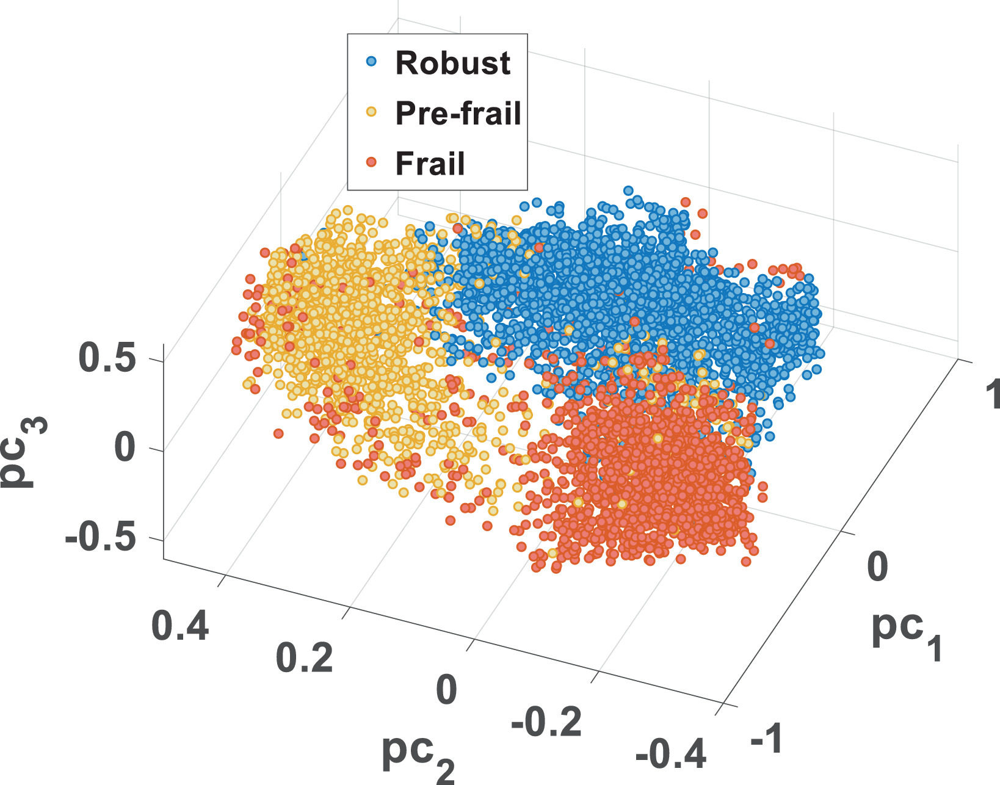 - class balance baseline Abbas

Notes on reproducibility and limitations (brief)
- Small and imbalanced stroke cohort, limited longitudinal follow‑up, and synthetic oversampling (SMOTE) limit generalizability. See Section 5 (Limitations & improvements) in the thesis for proposals (data pooling, interoperability, richer features and controlled trials).

For full tables, numeric results and all plotted figures, open the notebook attached.

--- 

## 5 Limitations & improvements

### Key limitations
- Proxy target in stroke data: Zhou et al. (FAC) is a clinically relevant proxy but does not capture the full multidimensional Fried Frailty Phenotype (FFP). Results on FAC should be interpreted as proxy‑based.
- Target variability: frailty lacks a single gold standard (FFP, Frailty Index, Clinical Frailty Scale). Label heterogeneity and clinician subjectivity reduce ML generalizability.
- Small / imbalanced cohorts: the stroke cohort has 10 participants (3,248 windows) and the frailty cohort is limited; high class imbalance required SMOTE and harms realism and specificity.
- EHR / interoperability issues: heterogeneous EHR standards and regional differences complicate feature engineering and model transfer across healthcare systems.
- Synthetic‑sample risks: adaptive SMOTE mitigates imbalance but can create borderline synthetic examples that reduce specificity and generalizability.

### Proposed improvements
- Acquire direct FFP labels or clinician assessments for stroke cohorts to validate FAC→FFP mapping and reduce proxy bias.
- Multi‑label / multi‑instrument strategy: combine FFP, FI and CFS where available and study concordant vs discordant patient subgroups.
- Increase cohort size and diversity: multi‑centre data pooling and longer longitudinal follow‑up to reduce intra‑patient variance and class imbalance.
- Richer feature sets: combine gait features (F1–F4) with non‑physical predictors (comorbidities, meds, ADLs, cognitive scores, self‑reports) to improve discriminatory power.
- Safer imbalance handling: compare SMOTE variants with class‑aware loss, cost‑sensitive learning, and careful threshold tuning; validate with external cohorts.
- Harmonize EHR ingestion: adopt common data models (OMOP / FHIR) and standardized feature extraction pipelines to improve portability.
- Clinical integration: design a DSS prototype with (i) local data ingestion (IoT + EHR + questionnaires), (ii) secure storage and OLAP analytics, (iii) configurable alert thresholds and human‑in‑the‑loop review to avoid alert fatigue.
- Interpretability & validation: keep SHAP + tree importances, present per‑patient explanations, and run clinician‑in‑the‑loop studies to evaluate trust and actionability.

Practical deployment roadmap
1. Define minimum feature set (gait + top socio‑clinical variables) and standardized acquisition protocol.  
2. Expand data collection to additional sites; collect FFP when possible.  
3. Retrain with stratified sampling or cost‑sensitive learners; validate on held‑out external sites.  
4. Build DSS dashboard with per‑case SHAP explanations and configurable operating points for screening vs triage.

---

## 6 Conclusion

Summary
- This study applied supervised ML to two complementary frailty problems: general frailty classification (FFP) and stroke rehabilitation monitoring (FAC → FFP proxy + improvement prediction).
- Tree‑based ensembles (Random Forest, Gradient Boosting) consistently perform best; Random Forest provided the best balance of accuracy, sensitivity and interpretability across tasks.
- Signal‑based gait features (F1 intensity, F4 dynamism) are consistently the most informative biomechanical predictors for frailty after stroke; cadence and periodicity provide secondary refinements.
- Combining objective gait metrics with socio‑clinical variables, larger balanced cohorts, and robust interoperability substantially improves classification performance and clinical relevance.

Takeaway for practice
- Gait‑derived features are valuable, interpretable markers for screening and monitoring frailty, but they are insufficient alone for robust, generalizable clinical decision making. A hybrid approach — multimodal data, ensemble models, explainability (SHAP) and clinician validation — is recommended for real‑world deployment.

Next steps
- Validate FAC→FFP mapping on cohorts with ground‑truth FFP.  
- Scale data collection (multi‑site, standardized EHR/IoT pipelines).  
- Prototype a clinician‑facing DSS with per‑patient explanations and adjustable operating points for screening vs triage.

