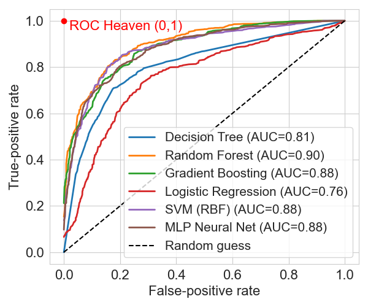

# From Treatment to Prevention — Machine learning applied to the elderly population and to patients affected by stroke.

[](http://dx.doi.org/10.13140/RG.2.2.26133.23529) [](#license)

## Section 1 - Introduction

Frailty poses a significant challenge for aging populations, as growing elderly care needs strain healthcare systems. This study introduces a machine‑learning framework for classifying and predicting frailty using publicly available EU datasets and comparing performance with recent work from North America and Asia. Main objectives: (1) classify frailty among older adults, (2) detect frailty in post‑stroke patients, (3) forecast short‑term health improvements.

We merge physical measurements with socio‑clinical variables, derive four gait metrics from wearable inertial sensors, evaluate interpretable classifiers, and use PCA for visualization. Results show feature importance varies by country; interpretability and interoperability are key for clinical adoption.

DOI Research paper
-----------------
[http://dx.doi.org/10.13140/RG.2.2.26133.23529](http://dx.doi.org/10.13140/RG.2.2.26133.23529)

Keywords
--------
Elderly care; healthcare sustainability; stroke rehabilitation; frailty classification; demographic variability; FFP; FAC; health improvement prediction; interoperability; gait analysis; AI; Machine Learning; feature engineering; SHAP; Principal Component Analysis; SMOTE; class imbalance; Random Forest.

Short description
-----------------
This repository implements a machine‑learning framework for frailty classification and health‑improvement prediction in elderly and post‑stroke populations. It combines socio‑clinical variables and sensor‑derived gait features, uses PCA and SHAP for interpretability, and evaluates classifiers with SMOTE tuning (Random Forest, Gradient Boosting, Logistic Regression, etc.).

Core objectives
---------------
- Classify frailty in elderly populations using socio‑clinical data and derived features.
- Detect frailty in post‑stroke patients using wearable IMU gait features.
- Predict short‑term health improvement and identify clinically meaningful features.

Repository contents
-------------------
- prediction.ipynb — main analysis notebook (feature extraction, PCA, feature selection, model training, evaluation, plots).
- master_windows_with_labels.csv — aggregated windowed feature outputs (cached intermediate).
- images/ — figures used in the thesis and notebooks (e.g. images/pca_variance.png).

Quick start
-----------
1. Open the main analysis notebook:
   - Open `c:\Users\admin\Documents\frailty\prediction.ipynb` in Jupyter Lab or VS Code Jupyter.
2. Install dependencies:
```sh
pip install -r requirements.txt   # or use environment.yml
jupyter lab
```
3. Run the analysis:
   - Execute the notebook top‑to‑bottom for a full run. Heavy steps (raw sensor windowing / feature extraction) are time‑consuming; use cached intermediate files when available:
     - `master_windows_with_labels.csv` contains precomputed window features and labels.
   - Reproducible flow:
     1. Prepare raw datasets under the dataset* folders (see notebook comments).
     2. Run preprocessing and windowing (or load `master_windows_with_labels.csv`).
     3. Run PCA, feature selection, and model training cells.

Notes on datasets & reproducibility
----------------------------------
- Some analyses depend on external open datasets; obtain them and place under the dataset* folders as documented in the notebook.
- Results depend on random seeds, train/test splits, and SMOTE settings — seeds are set in the notebooks where applicable.
- Verify dataset licenses prior to redistribution.

Figures & images
----------------
All figures referenced by the notebooks and README are in the `images/` folder. Examples:
- `images/pca_variance.png` — PCA explained variance plot.
- Other plots (feature importance, SHAP summaries, PCA visualizations) are saved alongside the notebook.

How to cite
-----------
Please mention this GitHub repo and the DOI of the research paper: [http://dx.doi.org/10.13140/RG.2.2.26133.23529](http://dx.doi.org/10.13140/RG.2.2.26133.23529)

License & data
--------------
- Code: check `LICENSE` (or add one) before reuse.
- Data: derived outputs may include material from public datasets. Verify and comply with original licenses.

Contributing & issues
---------------------
- Issues and pull requests are welcome. When reporting problems, reference the notebook and the specific cell(s) causing the issue.
- For compute/dataset questions, include system specs and whether cached intermediates were used.

Contact
-------
Send a direct message on GitHub. For repository issues, open a GitHub issue and include notebook name and cell index.

## 2 Related works

This section summarizes key literature on machine‑learning applications for frailty, gait monitoring and stroke rehabilitation. It highlights target definitions (FFP, FI), common data sources (EHRs, questionnaires, wearable IMUs), typical features and modelling choices, and the need for interpretability and interoperability.

Highlights
- Frailty definitions
  - Fried Frailty Phenotype (FFP): 5 criteria → robust / pre‑frail / frail (weight loss, exhaustion, low activity, slow gait, weakness).
  - Frailty Index (FI): deficit accumulation ratio (0–1).
- Data & sensors
  - EHR / questionnaire data (UK, Canada, China studies).
  - Wearable IMUs (wrist/ankle/foot/trunk) for free‑living gait/activity monitoring.
- Common ML methods
  - Tree ensembles (Random Forest, Gradient Boosting / XGBoost), SVM, logistic regression, kNN, MLP.
  - SMOTE is commonly used for class imbalance.
  - SHAP / feature‑ranking for explainability is recommended.
- Practical notes
  - Interpretability is crucial for clinical adoption.
  - Longitudinal and multi‑device data improve detection/prediction but require careful preprocessing.

Selected regional studies (brief)
### European Union
- Abbas et al. (2021, 2022): objective measurements + self‑reports; wearable longitudinal monitoring; derived gait features. See:
  - "Identifying Physical Worsening in Elderly Using Objective and Self‑Reported Measures" (ICABME 2021): https://ieeexplore.ieee.org/document/9604819
  - "Acceleration‑based gait analysis for frailty assessment in older adults" (Pattern Recognition Letters, 2022): https://www.sciencedirect.com/science/article/abs/pii/S0167865522002197
- Bochniewicz et al.: wrist IMU + Random Forest for arm use classification. See: https://pubmed.ncbi.nlm.nih.gov/28781056/
- Zhou et al.: foot IMU trajectories and spatio‑temporal gait metrics for stroke rehab monitoring. Dataset/paper:
  - Zenodo dataset (2024): https://zenodo.org/records/10534055 (DOI: 10.5281/zenodo.10534055)
  - Conference paper listing: https://pubmed.ncbi.nlm.nih.gov/40039788/

### United Kingdom
- Leghissa et al.: FRELSA dataset and derived FFP; logistic regression and MultiSURF feature selection. See: https://www.sciencedirect.com/science/article/pii/S1386505624002661

### North America
- Aponte et al.: primary care EMR (CPCSSN); boosting models, SMOTE. See: https://ijpds.org/article/view/1650
- Thapa et al.: fall risk prediction; XGBoost and SHAP. See: https://aging.jmir.org/2022/2/e35373
- Chen / Lucas et al.: IMU‑based monitoring in stroke patients. See:
  - Chen (IJERPH pilot): https://pubmed.ncbi.nlm.nih.gov/33572116/
  - Lucas et al. (IEEE JTEHM): https://doi.org/10.1109/JTEHM.2019.2897306

### Asia
- Wu et al. (China): CLHLS‑HF cohort; Random Forest + SHAP. See: https://doi.org/10.1186/s12877-022-03576-5
- Hong Kong (Yu, Wang): telehealth + wearable monitoring. See:
  - Yu et al. (IEEE Access, 2018): https://ieeexplore.ieee.org/document/8389199
  - Wang et al. (JMIR, 2020): https://www.jmir.org/2020/9/e19223/
- Korea (Kim / Lee / Park): video/vision and IMU approaches for FAC/gait severity. See:
  - Kim et al. (Topics in Stroke Rehabilitation, 2024): https://pubmed.ncbi.nlm.nih.gov/38841903/
  - Lee et al. (Journal of Personalized Medicine, 2021): https://www.mdpi.com/2075-4426/11/11/1080
  - Park et al. (JMIR preprint): https://pmc.ncbi.nlm.nih.gov/articles/PMC7527905/

Further reading
- Fried (FFP): https://doi.org/10.1093/gerona/56.3.M146
- Morley: https://pubmed.ncbi.nlm.nih.gov/23764209/
- Rockwood & Mitnitski: https://www.researchgate.net/publication/6204727_Frailty_in_Relation_to_the_Accumulation_of_Deficits

## 3 Research Method

Summary
- Supervised ML to study frailty (FFP) and a proxy via Functional Ambulation Category (FAC).
- Datasets: cross‑sectional socio‑clinical dataset and longitudinal IMU dataset (Zhou et al.).
- Pipeline: ingestion → windowing → feature engineering (F1–F4, AR optional) → stats & ranking → PCA → SMOTE (tuned) → randomized hyperparameter search → evaluation and interpretability (SHAP + tree importances).

### 3.1 Overview of targets and data selection
- Primary target: Fried Frailty Phenotype (FFP); FAC mapped to FFP for stroke dataset.
- Datasets: EU Open Research Repository sensor datasets and the Zhou et al. stroke cohort (Charité, Germany).

Collection methods
------------------
| Wrist IMU | 5-sensor IMU | Foot IMU |
|---:|:---:|:---|
|  |  |  |

### 3.2 Stroke sub-study (research question 2)
- Goals: (i) classify mobility (FAC/derived FFP) from IMU windows, (ii) predict short-term improvement between two visits.
- Raw IMU sampling: 120 Hz, five sensor placements (LF, RF, LW, RW, SA). Windows: non-overlapping 6 s (720 samples). Final stroke windows: 3,248 after cleaning.

### 3.3 Data reduction & missing data
- Non-overlapping 6 s windows; discard incomplete trailing samples.
- Missing wrist data for subject imu0011 (visit1) documented and excluded; no imputation performed due to low N.

### 3.4 Feature engineering (per 6 s window)
- Core gait features (per placement):
  - F1 — Intensity: trimmed (25%) range of acceleration magnitude (||a||, in g).
  - F2 — Cadence: detected peaks per window → steps/sec.
  - F3 — Periodicity: normalized autocorrelation entropy (Wiener–Khinchin → entropy of lag histogram).
  - F4 — Dynamism: ratio of large inter-sample |Δa| jumps (threshold = 75th percentile).
- Optional AR features (F5/F6) from vertical axis.
- Features pooled per placement or aggregated by group (LowerLimbs, UpperLimbs, Trunk).

Feature figures
---------------
| Acceleration magnitude | F1 violin | Autocorrelation |
|---|---|---|
|  |  |  |

| F2 violin | F3 violin | F4 violin |
|---|---|---|
|  |  |  |

### 3.5 Statistical testing & feature ranking
- Non‑parametric tests: Mann–Whitney U (pairwise) and Kruskal–Wallis across Robust / Pre‑frail / Frail.
- ReliefF (k=5) for feature ranking; F4 and F1 rank highest.

### 3.6 Dimensionality reduction (PCA)
- PCA on selected features (F1–F4). First 3 PCs retain most variance (> ~95% for aggregated features): PC1 (vigor), PC2 (stability), PC3 (rhythm).

PCA figures
-----------
| PCA upper limbs | PCA lower limbs |
|---|---|
|  |  |

| PCA trunk | PCA variance |
|---|---|
|  |  |

### 3.7 Class imbalance handling
- SMOTE embedded in pipeline and treated as hyperparameters (sampling_strategy ∈ {'auto','not majority'}, k_neighbors ∈ {3,5,7}).
- SMOTE applied only on training folds inside cross‑validation to avoid leakage.

Class distribution figures
-------------------------
| FAC distribution | FFP distribution |
|---|---|
|  |  |

### 3.8 Model selection & optimization
- Classifiers: Decision Tree, Random Forest, Gradient Boosting, Logistic Regression (elasticnet), SVM (RBF), MLP.
- Hyperparameter tuning: RandomizedSearchCV with StratifiedKFold (5 folds), scoring = f1_macro. SMOTE parameters included. Train/test split = 80:20.

### 3.9 Predicting improvement (aggregation)
- Window-level FAC predictions → per patient & placement medians for visit1 and visit2.
- Improvement flag = 1 if median_pred_visit2 − median_pred_visit1 > 0. Same rule applied to true medians.

## 3.10 Interpretability
- Tree-based importances (RF / GB) — global view.
- SHAP — global and per-sample explanations (beeswarm, force plots, class‑specific summaries). Figures saved in `images/`.

## 3.11 Reproducibility notes
- Random states set where applicable; seeds stored in notebooks.
- Full end‑to‑end requires raw datasets under dataset* folders; heavy steps are time‑consuming — cached CSVs like `master_windows_with_labels.csv` help.

## 4 Experimental results

This section reports key outcomes for the stroke sub‑study (RQ2), interpretability (RQ3) and cross‑framework comparisons (RQ4). Full tables and plots are in the notebook; representative figures are in `images/`.

### 4.2 Research question 2 — Frailty classification & prediction of health improvement (stroke)

#### 4.2.1 First sub‑problem — FAC (mobility) classification
- Six tuned classifiers evaluated on multi‑class FAC (1–5). Metrics are macro‑averaged. Random Forest achieved best window‑level F1 (0.636) and ROC–AUC (0.901). Gradient Boosting and MLP follow (F1 ≈ 0.60–0.62). Logistic Regression scored lowest (F1 ≈ 0.40).
- Collapsing FAC into FFP (Robust / Semi‑frail / Frail) increases apparent accuracy; RF remains best (FFP F1 ≈ 0.696).
- ROC curves and confusion matrices are saved under `images/` (see `ROC_FAC.png`, `ROC_FFP.png`, `RF_FFP_confusion_matrix_abs.png`, `RF_FFP_confusion_matrix_pct.png`).
- Note: high ROC–AUC alone does not ensure clinically useful detection of minority frail cases.

ROC & confusion figures
-----------------------
| ROC (FAC) | ROC (FFP) |
|---|---|
|  |  |

| FFP confusion (counts) | FFP confusion (%) |
|---|---|
|  |  |

#### 4.2.2 Second sub‑problem — Predicting health improvement between visits
- Patient‑level improvement: Random Forest predicted patient‑level improvement perfectly on the held‑out test set (10/10). RF Patient‑level F1 = 1.00 (see notebook).
- Patient×Placement level: performance decreases at placement granularity (n ≈ 47). Gradient Boosting achieved higher placement‑level accuracy (~0.87) vs RF (~0.81).

Radar plots
-----------
| Radar (Random Forest) |
|---|
|  |

#### 4.2.3 Notes on clinical trade‑offs and SMOTE
- Adaptive SMOTE inside CV improves recall for minority frail classes but can increase synthetic‑sample overlap near boundaries, reducing specificity. Threshold tuning recommended for application trade‑offs.
- `images/balanceSMOTE.png` visualizes class balance across studies.

### 4.3 Research question 3 — Interpretability

#### 4.3.2 Interpretability for the stroke (FAC) task
- RF impurity reduction and SHAP agree that F1 (intensity) and F4 (dynamism) are dominant (~70%+ combined). F3 (periodicity) and F2 (cadence) are secondary.
- SHAP per‑class plots (FAC 1…5) and force plots are saved in `images/` (see `summary_beeswarm_*` and `force_*` files).

Interpretability figures
------------------------
| Global importance | SHAP FAC 1 |
|---|---|
|  |  |

| SHAP FAC 3 | SHAP FAC 4 |
|---|---|
|  |  |

### 4.4 Research question 4 — Frameworks comparison
- Summary: combining gait metrics with socio‑clinical variables on balanced cohorts yields best performance. In small, imbalanced stroke cohorts, gait‑only features (F1–F4) produce clinically meaningful signals but underperform richer feature sets.
- Our RF + adaptive‑SMOTE pipeline achieves competitive results on the stroke FAC task (RF window‑level ROC–AUC ≈ 0.90, FFP F1 ≈ 0.70) and strong patient‑level improvement prediction in this small cohort.

Comparison figures
------------------
| Class balance & SMOTE | PCA baseline (Abbas) |
|---|---|
|  |  |

Notes on reproducibility and limitations
- Small and imbalanced stroke cohort, limited longitudinal follow‑up, and SMOTE limit generalizability. See Section 5 for proposals.

For full tables and plots, open `prediction.ipynb`.

---

## 5 Limitations & improvements

Key limitations
---------------
- FAC (Zhou et al.) is a clinically relevant proxy but does not capture full FFP; interpret as proxy‑based.
- Frailty has no single gold standard (FFP, FI, CFS); label heterogeneity reduces generalizability.
- Small/imbalanced cohorts: stroke cohort has 10 participants (3,248 windows); high class imbalance required SMOTE.
- EHR/interoperability heterogeneity complicates feature engineering and model transfer.
- Synthetic‑sample risks: adaptive SMOTE can create borderline synthetic examples.

Proposed improvements
---------------------
- Acquire direct FFP labels or clinician assessments for stroke cohorts to validate FAC→FFP mapping.
- Multi‑label / multi‑instrument approaches: combine FFP, FI and CFS.
- Increase cohort size and diversity: multi‑centre pooling and longer follow‑up.
- Richer feature sets: combine gait features (F1–F4) with comorbidities, medications, ADLs, cognitive scores.
- Safer imbalance handling: compare SMOTE variants with class‑aware loss and cost‑sensitive learning.
- Harmonize EHR ingestion: adopt OMOP / FHIR and standardized extraction pipelines.
- Clinical integration: design a DSS with secure ingestion, OLAP analytics, alert thresholds and human‑in‑the‑loop review.
- Maintain SHAP + tree importances and perform clinician‑in‑the‑loop validation studies.

Practical deployment roadmap
1. Define minimum feature set (gait + top socio‑clinical variables).
2. Expand data collection to additional sites; collect FFP where possible.
3. Retrain with stratified sampling or cost‑sensitive learners; validate on external sites.
4. Build DSS dashboard with per‑case SHAP explanations and configurable operating points.

---

## 6 Conclusion

Summary
-------
- Applied supervised ML to frailty classification (FFP) and stroke rehabilitation monitoring (FAC → FFP proxy + improvement prediction).
- Tree‑based ensembles (Random Forest, Gradient Boosting) perform best; Random Forest offers balance of accuracy, sensitivity and interpretability.
- Gait features (F1 intensity, F4 dynamism) are the most informative biomechanical predictors; cadence and periodicity refine predictions.
- Combining gait metrics with socio‑clinical data, larger balanced cohorts, and interoperable pipelines improves clinical relevance.

Takeaway for practice
---------------------
- Gait‑derived features are valuable and interpretable but insufficient alone for robust clinical decision making. A hybrid approach — multimodal data, ensemble models, SHAP explanations and clinician validation — is recommended.

Next steps
----------
- Validate FAC→FFP mapping on cohorts with ground‑truth FFP.
- Scale data collection with multi‑site standardized EHR/IoT pipelines.
- Prototype a clinician‑facing DSS with per‑patient explanations and adjustable operating points.

## References (selected)
- Abbas et al., "Identifying Physical Worsening in Elderly Using Objective and Self‑Reported Measures" (ICABME 2021): https://ieeexplore.ieee.org/document/9604819  
- Abbas et al., "Acceleration‑based gait analysis for frailty assessment in older adults" (PRL, 2022): https://www.sciencedirect.com/science/article/abs/pii/S0167865522002197  
- Bochniewicz et al., "Measuring Functional Arm Movement after Stroke..." (2017): https://pubmed.ncbi.nlm.nih.gov/28781056/  
- Zhou et al., Zenodo dataset (2024): https://zenodo.org/records/10534055 (DOI: 10.5281/zenodo.10534055)  
- Leghissa et al., FRELSA: https://www.sciencedirect.com/science/article/pii/S1386505624002661  
- Aponte et al.: https://ijpds.org/article/view/1650  
- Thapa et al. (JMIR Aging, 2022): https://aging.jmir.org/2022/2/e35373  
- Chen et al. (IJERPH): https://pubmed.ncbi.nlm.nih.gov/33572116/  
- Lucas et al. (IEEE JTEHM): https://doi.org/10.1109/JTEHM.2019.2897306  
- Wu et al. (BMC Geriatrics, 2022): https://doi.org/10.1186/s12877-022-03576-5  
- Yu et al. (IEEE Access, 2018): https://ieeexplore.ieee.org/document/8389199  
- Wang et al. (JMIR, 2020): https://www.jmir.org/2020/9/e19223/  
- Fried (FFP): https://doi.org/10.1093/gerona/56.3.M146

## License
- Check `LICENSE` in the repository for code reuse terms.
